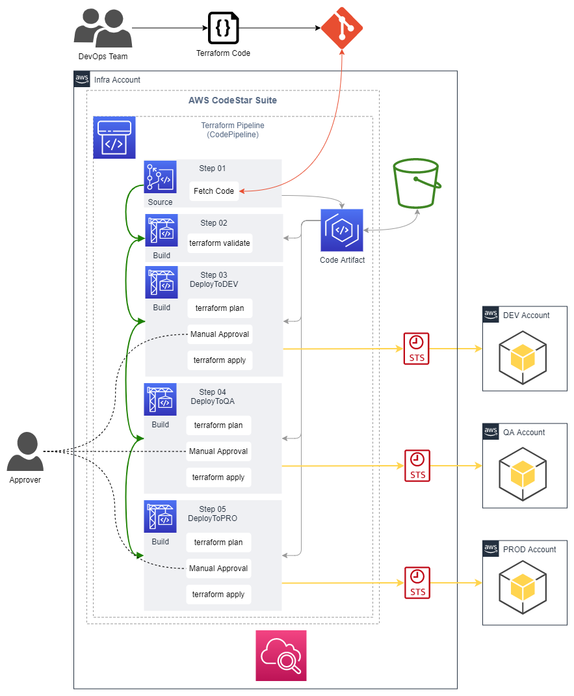

# AWS CodePipeline Project to deploy terraform templates

## Resources deployed by this manifest:

- Artifact S3 Bucket
- KMS Key for the Artifact S3 Bucket
- IAM Role for the CodePipeline Project.
- IAM Role for the CodeBuild Project.
- CodeBuil Projects.
- CodePipeline Projects.

### Deployment diagram:



## Tested with: 

| Environment | Application | Version  |
| ----------------- |-----------|---------|
| WSL2 Ubuntu 20.04 | Terraform | v1.2.2  |

## Initialization How-To:
Located in the root directory, make the necessary changes in the variables.tf file and run "terraform init" to download the necessary modules and start the backend.

```bash
terraform init
```

## Deployment How-To:

Create a .tfvar with a content like the following:

```bash
aws_profile       = "default"
code_connection   = "arn:aws:codestar-connections:REGION:ACCOUNT_ID:connection/XXXXXXXXXXXXXXXXXXXXXXXXXXX"
repository_id     = "USER_NAME/REPO_NAME"
repository_branch = "main"
terraform_version = "1.2.3"
```` 
Located in the root directory, make the necessary changes in the variables.tf file and run the manifests:

```bash
terraform apply
```
## Deployment How-To:

## Debugging / Troubleshooting:

#### **Debugging Tip #1**: 

#### **Known issue #1**: 
 - **Issue**: 
- **Cause**: 
- **Solution**: 

## Author:

- [@JManzur](https://jmanzur.com)

## Documentation:

- [EXAMPLE](URL)